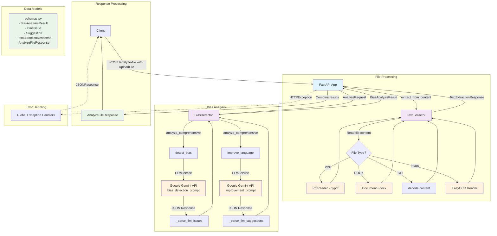

# Job Description Bias Detection API

[](https://www.python.org/downloads/)
[](https://fastapi.tiangolo.com/)
[](LICENSE)
[](Dockerfile)

An AI-powered service that analyzes job descriptions to detect bias and suggest inclusive language improvements using Google Gemini LLM and rule-based detection.

## 🚀 Features

- **Multi-format Support**: Analyze text from PDFs, DOCX files, images, or plain text
- **Comprehensive Bias Detection**: Identifies gender, age, racial, cultural, disability, religious, and other biases
- **Language Improvement**: Provides suggestions for clarity, inclusivity, professionalism, and SEO optimization
- **Scoring System**: Generates bias, inclusivity, clarity, and readability scores
- **RESTful API**: Easy-to-integrate FastAPI endpoints
- **Docker Ready**: Containerized deployment
- **Robust Testing**: Comprehensive test suite with evaluation harness

## 📋 Table of Contents

- [Installation](#installation)
- [Quick Start](#quick-start)
- [API Documentation](#api-documentation)
- [Configuration](#configuration)
- [Architecture](#architecture)
- [Testing](#testing)
- [Contributing](#contributing)
- [License](#license)

## 🛠️ Installation

### Prerequisites

- Python 3.10+
- Google Gemini API key
- Docker (optional, for containerized deployment)

### Local Development

1. **Clone the repository**
   ```bash
   git clone https://github.com/your-username/job-bias-detector.git
   cd job-bias-detector
   ```

2. **Create virtual environment**
   ```bash
   python -m venv venv
   source venv/bin/activate  # On Windows: venv\Scripts\activate
   ```

3. **Install dependencies**
   ```bash
   pip install -r requirements.txt
   ```

4. **Set up environment variables**
   ```bash
   cp .env.example .env
   # Edit .env and add your GOOGLE_GEMINI_API_KEY
   ```

5. **Run the application**
   ```bash
   uvicorn app.main:app --reload --host 0.0.0.0 --port 8000
   ```

### Docker Deployment

```bash
# Build the image
docker build -t job-bias-detector .

# Run the container
docker run -p 8000:8000 -e GOOGLE_GEMINI_API_KEY=your_api_key job-bias-detector
```

## 🚀 Quick Start

### Basic Text Analysis

```python
import requests

# Analyze job description text
response = requests.post("http://localhost:8000/analyze", 
    json={"text": "We're looking for a rockstar developer who can work long hours..."})
    
result = response.json()
print(f"Bias Score: {result['bias_score']}")
print(f"Issues Found: {len(result['issues'])}")
```

### File Upload Analysis

```python
# Analyze a PDF job description
with open("job_description.pdf", "rb") as f:
    response = requests.post("http://localhost:8000/analyze-file",
        files={"file": f})
        
result = response.json()
print(f"Extracted Text: {result['extracted_text'][:100]}...")
print(f"Bias Analysis: {result['analysis']['overall_assessment']}")
```

## 📚 API Documentation

### Endpoints

| Method | Endpoint | Description |
|--------|----------|-------------|
| `GET` | `/` | Welcome message |
| `GET` | `/health` | Health check |
| `POST` | `/analyze` | Analyze plain text |
| `POST` | `/analyze-file` | Upload and analyze file |
| `POST` | `/extract` | Extract text from file |

### Example Request/Response

**POST /analyze**

```json
{
  "text": "Looking for a young, energetic developer who can work in our fast-paced environment..."
}
```

**Response:**
```json
{
  "role": "Developer",
  "industry": "Technology",
  "bias_score": 0.6,
  "inclusivity_score": 0.4,
  "clarity_score": 0.7,
  "issues": [
    {
      "type": "age",
      "severity": "medium",
      "text": "young, energetic",
      "explanation": "Age-related terms that may discourage older candidates",
      
    }
  ],
  "suggestions": [
    {
      "category": "inclusivity",
      "original": "young, energetic developer",
      "improved": "motivated developer",
      "explanation": "Removes age bias while maintaining intent"
    }
  ],
  "improved_text": "Looking for a motivated developer who can work in our dynamic environment...",
  "seo_keywords": ["developer", "technology", "programming"],
  "overall_assessment": "Moderate bias detected. Consider revising age-related language."
}
```

For complete API documentation, visit `http://localhost:8000/docs` after starting the server.

## ⚙️ Configuration

### Environment Variables

Create a `.env` file with the following variables:

```env
# Required
GOOGLE_GEMINI_API_KEY=your_gemini_api_key_here

# Optional
LOG_LEVEL=INFO
MAX_FILE_SIZE=10485760  # 10MB in bytes
```

### Supported File Formats

- **PDF**: `.pdf`
- **Word Documents**: `.docx`
- **Images**: `.png`, `.jpg`, `.jpeg` (OCR using Tesseract)
- **Text**: `.txt`

## 🏗️ Architecture

### Project Structure

```
job-bias-detector/
├── app/
│   ├── main.py              # FastAPI application
│   ├── models/
│   │   └── schemas.py       # Pydantic models
│   ├── services/
│   │   ├── bias_detector.py # Core bias detection logic
│   │   ├── llm_service.py   # Google Gemini integration
│   │   └── text_extractor.py # File processing
│   └── utils/
│       └── helpers.py       # Utility functions
├── tests/                   # Test suite
├── Dockerfile              # Container configuration
├── requirements.txt        # Python dependencies
└── README.md              # This file
```

### Technology Stack

- **Backend**: FastAPI, Python 3.10+
- **AI/ML**: Google Gemini API, textstat
- **File Processing**: PyPDF2, python-docx, Pillow, pytesseract
- **Testing**: pytest, FastAPI TestClient
- **Deployment**: Docker, Uvicorn

### Data Flow



## 🧪 Testing

### Run Tests

```bash
# Run all tests
pytest

# Run with coverage
pytest --cov=app --cov-report=html

# Run specific test file
pytest tests/test_bias_detector.py -v
```

### Test Coverage

The project maintains comprehensive test coverage including:

- Unit tests for all services and utilities
- Integration tests for API endpoints
- End-to-end evaluation with predefined test cases
- Error handling and edge cases

### Evaluation

Run the model evaluation suite:

```bash
python -m tests.evaluation.test_model_evaluation
```

Results are saved in `tests/evaluation/results/` for analysis.

## 🤝 Contributing

We welcome contributions! Please see our [Contributing Guide](CONTRIBUTING.md) for details.

### Development Setup

1. Fork the repository
2. Create a feature branch: `git checkout -b feature-name`
3. Make your changes and add tests
4. Run the test suite: `pytest`
5. Submit a pull request

### Code Style

- Follow PEP 8
- Use type hints
- Add docstrings for public functions
- Maintain test coverage above 80%

## 📄 License

This project is licensed under the MIT License - see the [LICENSE](LICENSE) file for details.

