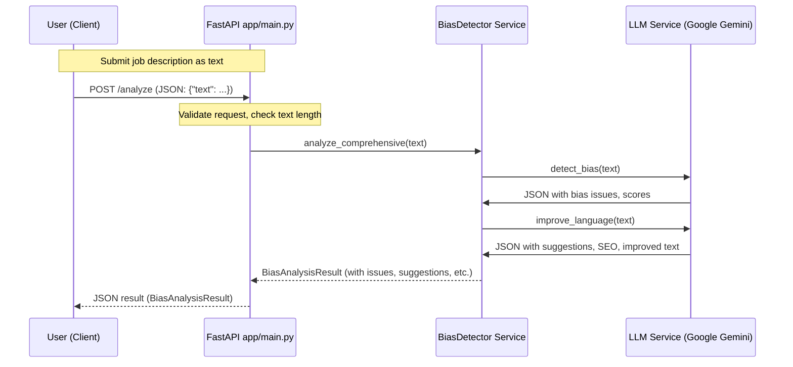
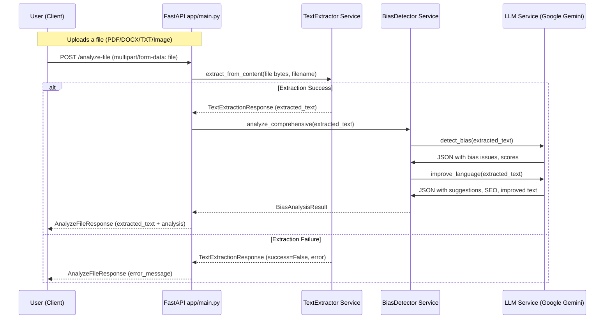

# Job Description Bias Detector — Detailed Documentation

Welcome to the detailed documentation of the **Python LLM Bias Detector** project. This guide provides an in-depth look at each core file, their purpose, how they interrelate, and the overall architecture, including a detailed view of API request handling and service interactions for both text-based and file-based analysis.

---

## 📑 Index

1. [Overview](#overview)  
2. [Core Application Files](#core-application-files)  
   - [app/models/schemas.py](#appmodelsschemspy)  
   - [app/services/bias_detector.py](#appservicesbias_detectorpy)  
   - [app/services/llm_service.py](#appservicesllm_servicepy)  
   - [app/services/text_extractor.py](#appservicestext_extractorpy)  
   - [app/utils/helpers.py](#apputilshelperspy)  
   - [app/main.py](#appmainpy)  
3. [Testing Suite](#testing-suite)  
   - [`tests/.coverage`](#testsscoverage)  
   - [`tests/__init__.py`](#testsinitpy)  
   - [`tests/test_bias_detector.py`](#teststest_bias_detectorpy)  
   - [`tests/test_llm_service.py`](#teststest_llm_servicepy)  
   - [`tests/test_main.py`](#teststest_mainpy)  
   - [`tests/test_text_extractor.py`](#teststest_text_extractorpy)  
4. [Configuration & Infrastructure](#configuration--infrastructure)  
   - [Dockerfile](#dockerfile)  
   - [pyproject.toml](#pyprojecttoml)  
   - [requirements.txt](#requirementstxt)  
   - [.dockerignore](#dockerignore)  
5. [Original Documentation](#original-documentation)  
6. [Detailed Request Flow & Architecture](#detailed-request-flow--architecture)  
    - [Text Analysis Request Flow](#text-analysis-request-flow)
    - [File Analysis Request Flow](#file-analysis-request-flow)
---

## Overview

This project offers a **FastAPI**-powered REST API to analyze job descriptions for potential biases using a combination of:

- **Google Gemini LLM**-powered prompts for bias detection and language improvement  
- **Rule-based parsing** and **fallbacks**  
- **Multi-format text extraction** (PDF, DOCX, TXT, Image OCR)  

Results include bias scores, detailed findings, inclusive rewriting suggestions, SEO keywords, and an overall assessment.

---

## Core Application Files

### app/models/schemas.py

Defines all **Pydantic** models and Enums for request/response validation:

- **Enums**  
  - `BiasType` (gender, age, racial, cultural, …)  
  - `SeverityLevel` (low, medium, high)  
  - `CategoryType` (bias, clarity, SEO, inclusivity, professionalism, legal)  

- **Models**  
  - `BiasIssue` (type, text span, severity, explanation)  
  - `Suggestion` (original vs. improved text, rationale, category)  
  - `BiasAnalysisResult` (role, industry, scores, issues, suggestions, keywords, improved_text, overall_assessment)  
  - `AnalyzeRequest` (input text)  
  - `TextExtractionResponse` (success flag, extracted_text, file_type, error_message)  
  - `AnalyzeFileResponse` (bundles extraction + analysis)  

These schemas ensure consistent payloads across API endpoints and internal service layers.

---

### app/services/bias_detector.py

Implements the **bias analysis workflow**:

- **Dependencies**  
  - `LLMService` for LLM calls  
  - `textstat` (optional rule-based metrics)  

- **Key Method**  
  - `analyze_comprehensive(text: str) → BiasAnalysisResult`  
    1. Calls `LLMService.detect_bias(text)` to identify issues and base scores.  
    2. Calls `LLMService.improve_language(text)` to generate rewriting suggestions, SEO keywords, and improved text.  
    3. Parses and converts LLM JSON responses via private helpers:  
       - `_parse_llm_issues(...)` → [`BiasIssue`]  
       - `_parse_llm_suggestions(...)` → [`Suggestion`]  
       - `_parse_category(...)` to handle “pipe-separated” categories  
    4. Converts string scores to floats with safe fallbacks.  
    5. Returns a fully populated `BiasAnalysisResult`, gracefully handling LLM failures with default values.

- **Extensible Points**  
  - Placeholder for additional rule-based detection (`_detect_rule_based_bias`).  
  - Hooks for custom scoring or metrics via `textstat`.

---

### app/services/llm_service.py

Wraps interactions with the **Google Gemini** LLM:

- **Initialization**  
  - Loads `.env` variables (`GOOGLE_GEMINI_API_KEY`)  
  - Configures `google.generativeai` and instantiates `gemini-2.0-flash` model  

- **Prompts & Methods**  
  - `detect_bias(text: str) → Dict`  
    - Constructs a multi-step prompt: validation, context analysis, bias detection (with examples), scoring rules.  
    - Calls `model.generate_content(...)` and strips markdown to parse JSON.  
    - Returns parsed bias JSON.  

  - `improve_language(text: str) → Dict`  
    - Builds a rewrite prompt emphasizing clarity, inclusivity, professionalism, SEO.  
    - Invokes LLM and parses JSON.  

- **Error Handling**  
  - Detects common errors (503 overloaded, quota/limit, timeout, authentication) and raises `HTTPException` with appropriate status codes.  
  - Generic fallback for unexpected errors.

---

### app/services/text_extractor.py

Handles **multi-format content extraction**:

- **Supported Types**:  
  - **Image** (`jpg`, `png`, …) via **EasyOCR**  
  - **PDF** via **pypdf**  
  - **DOCX** via **python-docx**  
  - **TXT** (UTF-8 with Latin-1 fallback)  

- **Method**  
  - `extract_from_content(content: bytes, filename: str) → TextExtractionResponse`  
    1. Derives extension.  
    2. Routes to one of:  
       - `_extract_from_image(...)`  
       - `_extract_from_pdf(...)`  
       - `_extract_from_docx(...)`  
       - `_extract_from_txt(...)`  
    3. Returns `success`, `extracted_text`, `file_type`, or error.

- **Failure Cases**  
  - Unsupported file types  
  - Parsing errors (caught and returned as `success=False` with `error_message`)

---


### app/main.py

Defines **FastAPI** application and routes:

- **Initialization**  
  - `load_dotenv()`  
  - Global CORS enabled for local front-ends.  
  - Instantiates `TextExtractor` and `BiasDetector`.  

- **Exception Handlers**  
  - Custom JSON format for `HTTPException` and generic exceptions with user-friendly `type` via `get_error_type(status_code)`.

- **Endpoints**  
  - `GET /` — Service health check.  
  - `GET /health` — Detailed health.  
  - `POST /extract` — Raw text extraction from file upload.  
  - `POST /analyze` — Bias analysis of JSON text (`AnalyzeRequest` → `BiasAnalysisResult`).  
  - `POST /analyze-file` — Combined extract + analyze convenience endpoint (`AnalyzeFileResponse`).

- **Validation**  
  - Minimum text length (50 chars) enforced on `/analyze`.

---

## Testing Suite

### tests/.coverage

Coverage database (SQLite).  
_Not part of source logic; generated by `pytest --cov`._

### tests/__init__.py

Package marker for pytest; typically empty.

### tests/test_bias_detector.py

Unit tests for `BiasDetector`, covering:

- Basic structure and schema compliance.  
- String → float score conversions.  
- Error fallbacks when LLM calls fail.  
- Parsing edge cases for issues and suggestions.  
- Category parsing logic.

### tests/test_llm_service.py

Tests for `LLMService`:

- Initialization behavior with/without API key.  
- JSON extraction from markdown-wrapped responses.  
- Error handling (503, quota, timeout, authentication, generic).

### tests/test_main.py

Integration tests for API endpoints:

- Root and health endpoints.  
- `/extract` validations (no file, empty, too large, missing filename).  
- `/analyze` validations (short text, missing field, exception paths).  
- `/analyze-file` end-to-end flows with mocked extractor & detector.

### tests/test_text_extractor.py

Validation of `TextExtractor` methods:

- PDF, DOCX, TXT, and Image extraction (both real and mocked).  
- Encoding fallback for Latin-1.  
- Error reporting on invalid content.

---

## Configuration & Infrastructure

### Dockerfile

Containerizes the app:

- Base: `python:3.10-slim`  
- Installs system libs (`build-essential`, `libpq-dev`).  
- Copies `requirements.txt` → `pip install`.  
- Adds non-root `appuser`.  
- Exposes port `8000`.  
- Entrypoint: `uvicorn app.main:app --host 0.0.0.0 --port 8000`.

### pyproject.toml

Pytest configuration:

```toml
[tool.pytest.ini_options]
testpaths   = ["tests"]
python_files = ["test_*.py"]
addopts     = "-v --cov=app --cov-report=term-missing"
asyncio_mode = "auto"
```

### requirements.txt

Pinning dependencies:

```
fastapi==0.104.1
uvicorn==0.24.0
python-multipart==0.0.6
pydantic==2.5.0
google-generativeai==0.3.2
python-dotenv==1.0.0
pypdf==5.8.0
python-docx==1.1.0
Pillow==10.1.0
transformers==4.36.0
nltk==3.8.1
textstat==0.7.3
requests==2.31.0
easyocr
pytest==7.4.3
pytest-asyncio==0.21.1
pytest-cov==4.1.0
httpx==0.25.1
```

### .dockerignore

Optimizes Docker builds by excluding:

```
__pycache__/
*.py[cod]
*.so
venv/
.env*
.idea/
.vscode/
*.log
htmlcov/
dist/
.DS_Store
```

---

## Original Documentation (Documentation.md)

This file provides quickstart instructions, feature overview, installation steps, and sample API usage. It serves as the user-facing README.

---

## Detailed Request Flow & Architecture

Below are architecture diagrams for the two main user flows: **Text Analysis** and **File Analysis**. These diagrams illustrate every processing step, showing which endpoints are called, the internal service interactions, and the round-trip with the LLM service.

---

### Text Analysis Request Flow



#### Detailed Steps:

1. **User** sends a `POST /analyze` request with a JSON body containing the job description text.
2. **FastAPI app** receives and validates the request (minimum length, JSON schema).
3. The **BiasDetector** service's `analyze_comprehensive` method is called with the text.
4. **BiasDetector**:
    - Calls **LLMService**'s `detect_bias` to obtain bias issues and scores.
    - Calls **LLMService**'s `improve_language` to get suggestions, keywords, and improved text.
5. **LLMService** interacts with the Google Gemini LLM, parsing and returning JSON responses.
6. **BiasDetector** processes, merges, and formats results into a `BiasAnalysisResult` object.
7. **API** responds to the user with the formatted JSON.

---

### File Analysis Request Flow



#### Detailed Steps:

1. **User** sends a `POST /analyze-file` request with a file upload (PDF, DOCX, TXT, or image).
2. **FastAPI app** receives and validates the file.
3. The **TextExtractor** service's `extract_from_content` method is called with the file bytes and filename.
4. Depending on filetype, **TextExtractor** applies OCR or format-specific parsing to extract text.
    - If extraction is **successful**, the extracted text is passed to the **BiasDetector** service, following the same analysis process as in the text flow.
    - If extraction **fails**, an error response is returned to the user.
5. **BiasDetector** and **LLMService** interaction proceeds identically to the text workflow.
6. **API** responds to the user with both the extracted text and the bias analysis result.

---

### Component Interaction Overview

```mermaid
flowchart TB
  User["User (Client)"]
  MainApp["FastAPI App (app/main.py)"]
  TextExt["TextExtractor"]
  BiasDet["BiasDetector"]
  LLM["LLMService (Google Gemini)"]

  User --|POST /analyze|--> MainApp
  MainApp --|text|--> BiasDet
  BiasDet -- LLM
  BiasDet -.-> MainApp
  MainApp -.-> User

  User --|POST /analyze-file|--> MainApp
  MainApp -- file --> TextExt
  TextExt -- extracted_text --> MainApp
  MainApp --|text|--> BiasDet

  classDef api fill:#e1f5fe,stroke:#036
  classDef svc fill:#f3e5f5,stroke:#620
  classDef llm fill:#fff3e0,stroke:#a60
  class User,MainApp api
  class TextExt svc
  class BiasDet svc
  class LLM llm
```

---

## API Endpoints

### Analyze Text Endpoint

```api
{
    "title": "Analyze Text for Bias",
    "description": "Analyzes job description text for bias, clarity, inclusivity, and provides rewriting suggestions and SEO keywords.",
    "method": "POST",
    "baseUrl": "http://localhost:8000",
    "endpoint": "/analyze",
    "headers": [
        {
            "key": "Content-Type",
            "value": "application/json",
            "required": true
        }
    ],
    "queryParams": [],
    "pathParams": [],
    "bodyType": "json",
    "requestBody": "{\n  \"text\": \"We are looking for a dynamic young professional to join our team...\"\n}",
    "formData": [],
    "responses": {
        "200": {
            "description": "Bias analysis result",
            "body": "{\n  \"role\": \"...\",\n  \"industry\": \"...\",\n  \"bias_scores\": {\"gender\": 0.2, \"age\": 0.1},\n  \"clarity_score\": 0.8,\n  \"seo_score\": 0.7,\n  \"issues\": [...],\n  \"suggestions\": [...],\n  \"keywords\": [\"dynamic\", \"professional\"],\n  \"improved_text\": \"...\",\n  \"overall_assessment\": \"...\"\n}"
        },
        "422": {
            "description": "Validation Error",
            "body": "{\n  \"detail\": [ {\"msg\": \"field required\", \"type\": \"value_error.missing\"} ]\n}"
        }
    }
}
```

### Analyze File Endpoint

```api
{
    "title": "Analyze File for Bias",
    "description": "Extracts text from an uploaded file (PDF, DOCX, TXT, or image) and analyzes it for bias, clarity, inclusivity, and provides rewriting suggestions and SEO keywords.",
    "method": "POST",
    "baseUrl": "http://localhost:8000",
    "endpoint": "/analyze-file",
    "headers": [
        {
            "key": "Content-Type",
            "value": "multipart/form-data",
            "required": true
        }
    ],
    "queryParams": [],
    "pathParams": [],
    "bodyType": "form",
    "requestBody": "",
    "formData": [
        {
            "key": "file",
            "value": "The job description file to analyze",
            "required": true
        }
    ],
    "responses": {
        "200": {
            "description": "Extracted text and bias analysis result",
            "body": "{\n  \"extracted_text\": \"...\",\n  \"file_type\": \"pdf\",\n  \"bias_analysis\": { ... },\n  \"error_message\": null\n}"
        },
        "400": {
            "description": "File extraction or validation error",
            "body": "{\n  \"extracted_text\": null,\n  \"file_type\": null,\n  \"bias_analysis\": null,\n  \"error_message\": \"Unsupported file type or extraction error\"\n}"
        }
    }
}
```

---

**End of Documentation**